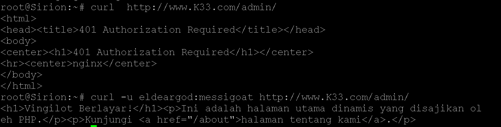

## Anggota Kelompok
| No | Nama                       | NRP         | Pembagian Tugas  |
|----|----------------------------|-------------|------------------|
| 1  | Aditya Reza Daffansyah     | 5027241034  | 1 - 10           | 
| 2  | I Gede Bagus Saka Sinatrya |	5027241088  | 11 - 20          | 

# Laporan Resmi Praktikum Jarkom

## Walkthrough Pengerjaan Praktikum Jarkom Modul 2
## Daftar Isi

- [Anggota Kelompok](#anggota-kelompok)
- [Daftar Isi](#daftar-isi)
- [Soal 1](#soal-1)
- [Soal 2](#soal-2)
- [Soal 3](#soal-3)
- [Soal 4](#soal-4)
- [Soal 5](#soal-5)
- [Soal 6](#soal-6)
- [Soal 7](#soal-7)
- [Soal 8](#soal-8)
- [Soal 9](#soal-9)
- [Soal 10](#soal-10)
- [Soal 11](#soal-11)
- [Soal 12](#soal-12)
- [Soal 13](#soal-13)
- [Soal 14](#soal-14)
- [Soal 15](#soal-15)
- [Soal 16](#soal-16)
- [Soal 17](#soal-17)
- [Soal 18](#soal-18)
- [Soal 19](#soal-19)
- [Soal 20](#soal-20)

### Soal 1
Di tepi Beleriand yang porak-poranda, Eonwe merentangkan tiga jalur: Barat untuk Earendil dan Elwing, Timur untuk Círdan, Elrond, Maglor, serta pelabuhan DMZ bagi Sirion, Tirion, Valmar, Lindon, Vingilot. Tetapkan alamat dan default gateway tiap tokoh sesuai glosarium yang sudah diberikan.

- Buat topologi lengkap sesuai permintaan soal, set address dan default gateway tiap client 

```
----- Config Eonwe (10.80.1.1) -----
auto eth0
iface eth0 inet dhcp

auto eth1
iface eth1 inet static
    address 10.80.1.1
    netmask 255.255.255.0

auto eth2
iface eth2 inet static
    address 10.80.2.1
    netmask 255.255.255.0

auto eth3
iface eth3 inet static
    address 10.80.3.1
    netmask 255.255.255.0
```
```
----- Config Earendil (10.80.1.2) -----
auto eth0
iface eth0 inet static
    address 10.80.1.2
    netmask 255.255.255.0
    gateway 10.80.1.1
```
```    
----- Config Elwing (10.80.1.3) -----
auto eth0
iface eth0 inet static
    address 10.80.1.3
    netmask 255.255.255.0
    gateway 10.80.1.1
```
```
----- Config Cirdan (10.80.2.2) -----
auto eth0
iface eth0 inet static
    address 10.80.2.2
    netmask 255.255.255.0
    gateway 10.80.2.1
```
```
----- Config Elrond (10.80.2.3) -----
auto eth0
iface eth0 inet static
    address 10.80.2.3
    netmask 255.255.255.0
    gateway 10.80.2.1
```
```
----- Config Maglor (10.80.2.4) -----
auto eth0
iface eth0 inet static
    address 10.80.2.4
    netmask 255.255.255.0
    gateway 10.80.2.1
```
```
----- Config Sirion (10.80.3.2) -----
auto eth0
iface eth0 inet static
    address 10.80.3.2
    netmask 255.255.255.0
    gateway 10.80.3.1
```
```
----- Config Tirion (10.80.3.3) -----
auto eth0
iface eth0 inet static
    address 10.80.3.3
    netmask 255.255.255.0
    gateway 10.80.3.1
```
```
----- Config Valmar (10.80.3.4) -----
auto eth0
iface eth0 inet static
    address 10.80.3.4
    netmask 255.255.255.0
    gateway 10.80.3.1
```
```
----- Config Lindon (10.80.3.5) -----
auto eth0
iface eth0 inet static
    address 10.80.3.5
    netmask 255.255.255.0
    gateway 10.80.3.1
```
```
----- Config Vingilot (10.80.3.6) -----
auto eth0
iface eth0 inet static
    address 10.80.3.6
    netmask 255.255.255.0
    gateway 10.80.3.1
```


### Soal 2
Angin dari luar mulai berhembus ketika Eonwe membuka jalan ke awan NAT. Pastikan jalur WAN di router aktif dan NAT meneruskan trafik keluar bagi seluruh alamat internal sehingga host di dalam dapat mencapai layanan di luar menggunakan IP address.

- Masuk ke router Eonwe update dan install iptables
```apt update && apt install iptables`

- Jalankan perintah ini
`iptables -t nat -A POSTROUTING -o eth0 -j MASQUERADE -s 10.80.0.0/16`


### Soal 3
Kabar dari Barat menyapa Timur. Pastikan kelima klien dapat saling berkomunikasi lintas jalur (routing internal via Eonwe berfungsi), lalu pastikan setiap host non-router menambahkan resolver 192.168.122.1 saat interfacenya aktif agar akses paket dari internet tersedia sejak awal.

- Buat konfigurasi DNS Resolver di semua client pada `/etc/resolv.conf`
`echo nameserver 192.168.122.1 > /etc/resolv.conf`


### Soal 4
Para penjaga nama naik ke menara, di Tirion (ns1/master) bangun zona K33.com sebagai authoritative dengan SOA yang menunjuk ke ns1.K33.com dan catatan NS untuk ns1.K33.com dan ns2.K33.com. Buat A record untuk ns1.K33.com dan ns2.K33.com yang mengarah ke alamat Tirion dan Valmar sesuai glosarium, serta A record apex K33.com yang mengarah ke alamat Sirion (front door), aktifkan notify dan allow-transfer ke Valmar, set forwarders ke 192.168.122.1. Di Valmar (ns2/slave) tarik zona K33.com dari Tirion dan pastikan menjawab authoritative. Pada seluruh host non-router ubah urutan resolver menjadi IP dari ns1.K33.com → ns2.K33.com → 192.168.122.1. Verifikasi query ke apex dan hostname layanan dalam zona dijawab melalui ns1/ns2.'

- Melakukan update repositori dan menginstal paket `bind9` di Iirion (Master).
```
apt update && apt install bind9 -y
ln -s /etc/init.d/named /etc/init.d/bind9
```

- Mengatur file konfigurasi opsi global BIND untuk menetapkan `forwarders` ke `192.168.122.1`. Ini berarti jika DNS Tirion tidak mengetahui alamat suatu domain (misal, `google.com`), ia akan meneruskan (forward) permintaan tersebut ke IP router.

```
nano /etc/bind/named.conf.options

options {
        directory "/var/cache/bind";
        dnssec-validation auto; 
        listen-on-v6 { any; };

        forwarders {
                192.168.122.1; 
        };
        allow-query { any; };
};
```

- Mendaftarkan zona `K33.com` di server Tirion sebagai server `master`.
```
nano /etc/bind/named.conf.local

zone "K33.com" {
    type master;
    file "/etc/bind/K33.com";
    notify yes;
    allow-transfer { 10.80.3.4; };
};
```

- Pembuatan File Zone (`/etc/bind/K33.com`)
```
nano /etc/bind/K33.com

$TTL    604800
@       IN      SOA     ns1.K33.com. root.K33.com. (
                        2025101201      ; Serial
                         604800         ; Refresh
                          86400         ; Retry
                        2419200         ; Expire
                         604800 )       ; Negative Cache TTL
;
; Name Servers (NS Records)
@       IN      NS      ns1.K33.com.
@       IN      NS      ns2.K33.com.

; A Records 
@       IN      A       10.80.3.2       ; K33.com -> Sirion
ns1     IN      A       10.80.3.3       ; ns1 -> Tirion
ns2     IN      A       10.80.3.4       ; ns2 -> Valmar
www     IN      A       10.80.3.2       ; www -> Sirion
```

- Menerapkan semua perubahan konfigurasi dengan me-restart layanan BIND9.
`service bind9 restart`

- Pada server slave (Valmar), lakukan update dan instalasi bind9
```
apt update && apt install bind9 -y
ln -s /etc/init.d/named /etc/init.d/bind9
```
- Mengkonfigurasi Valmar sebagai `slave` untuk zona `K33.com`.
```
nano /etc/bind/named.conf.local

zone "K33.com" {
    type slave;
    file "K33.com";
    masters { 10.80.3.3; }; 
};
```
- Menerapkan konfigurasi `Slave` dan memicu `zone transfer` pertama.
`service bind9 restart`

- KE SEMUA CLIENT, lakukan konfigurasi pada `/etc/resolv.conf`
```
nano /etc/resolv.conf

search K33.com
nameserver 10.80.3.3
nameserver 10.80.3.4
nameserver 192.168.122.1
```

- Testing dengan melakukan `ping` pada salah satu client
`ping K33.com -c 5`


### Soal 5
“Nama memberi arah,” kata Eonwe. Namai semua tokoh (hostname) sesuai glosarium, eonwe, earendil, elwing, cirdan, elrond, maglor, sirion, tirion, valmar, lindon, vingilot, dan verifikasi bahwa setiap host mengenali dan menggunakan hostname tersebut secara system-wide. Buat setiap domain untuk masing masing node sesuai dengan namanya (contoh: eru.<xxxx>.com) dan assign IP masing-masing juga. Lakukan pengecualian untuk node yang bertanggung jawab atas ns1 dan ns2

- di Tirion, ubah serial number, dan tambahkan hostname pada file zone
```
nano /etc/bind/K33.com

; -----  ADD HOSTNAME DI SINI -----
; Hostname Klien
earendil  IN    A       10.80.1.2
elwing    IN    A       10.80.1.3
cirdan    IN    A       10.80.2.2
elrond    IN    A       10.80.2.3
maglor    IN    A       10.80.2.4

; Hostname Server
sirion    IN    A       10.80.3.2
lindon    IN    A       10.80.3.5
vingilot  IN    A       10.80.3.6
```

- Restart layanan bind9
`service bind9 restart`

- Test ping di client mana saja
```
ping cirdan -c 2
ping cirdan.K33.com -c 2
ping elrond.K33.com -c 2
```


### Soal 6
Lonceng Valmar berdentang mengikuti irama Tirion. Pastikan zone transfer berjalan, Pastikan Valmar (ns2) telah menerima salinan zona terbaru dari Tirion (ns1). Nilai serial SOA di keduanya harus sama

- Edit konfigurasi pada `/etc/bind/K33.com`, tambahkan serial number ubah jadi 3
```
eonwe     IN    A       10.80.3.1
tirion    IN    CNAME   ns1.K33.com.
valmar    IN    CNAME   ns2.K33.com.
```

- Restart service bind9
`service bind9 restart`

- Tes apakah SOA pada Master dan client sama 
```
dig @tirion.K33.com K33.com SOA
dig @valmar.K33.com K33.com SOA
```


### Soal 7
Peta kota dan pelabuhan dilukis. Sirion sebagai gerbang, Lindon sebagai web statis, Vingilot sebagai web dinamis. Tambahkan pada zona <xxxx>.com A record untuk sirion.<xxxx>.com (IP Sirion), lindon.<xxxx>.com (IP Lindon), dan vingilot.<xxxx>.com (IP Vingilot). Tetapkan CNAME :
www.<xxxx>.com → sirion.<xxxx>.com, 
static.<xxxx>.com → lindon.<xxxx>.com, dan 
app.<xxxx>.com → vingilot.<xxxx>.com. 
Verifikasi dari dua klien berbeda bahwa seluruh hostname tersebut ter-resolve ke tujuan yang benar dan konsisten.

- Edit config `/etc/bind/K33.com`, update serial number

# memastikan A record dan Canonical NAME record baru
# comment sirion dengan A record, karena A dan CNAME tidak boleh digunakan secara bersamaan
; ; www     IN      A       10.80.3.2       ; www -> Sirion

# tambahkan di line paling bawah
www       IN    CNAME   sirion.K33.com.
static    IN    CNAME   lindon.K33.com.
app       IN    CNAME   vingilot.K33.com.

- Restart bind9
`service bind9 restart`

- Lakukan pengetesan
```
Tes dari Erarendil
dig www.K33.com

tes alias static (IP Lindon)
ping -c 2 static.K33.com

tes alias app (IP Vingilot)
ping -c 2 app.K33.com

tes dari Cirdan
tes alias www (menujukkan alias dan IP)
host www.K33.com

tes alias static (menujukkan alias dan IP)
host static.K33.com

tes alias app (menujukkan alias dan IP)
host app.K33.com
```


### Soal 8
Setiap jejak harus bisa diikuti. Di Tirion (ns1) deklarasikan satu reverse zone untuk segmen DMZ tempat Sirion, Lindon, Vingilot berada. Di Valmar (ns2) tarik reverse zone tersebut sebagai slave, isi PTR untuk ketiga hostname itu agar pencarian balik IP address mengembalikan hostname yang benar, lalu pastikan query reverse untuk alamat Sirion, Lindon, Vingilot dijawab authoritative.

- Tambahkan zone baru untuk reverse zone di `/etc/bind/named.conf.local`
```
zone "3.80.10.in-addr.arpa" {
    type master;
    file "/etc/bind/db.10.80.3"; 
    allow-transfer { 10.80.3.4; }; /
};
```

- Buat file zona reverse di `/etc/bind/db.10.80.3`
```
$TTL    604800
@       IN      SOA     ns1.K33.com. root.K33.com. (
                        2025101201      ; Serial (NAIKKAN NOMOR INI!)
                         604800         ; Refresh
                          86400         ; Retry
                        2419200         ; Expire
                         604800 )       ; Negative Cache TTL
;
; Name Servers
@       IN      NS      ns1.K33.com.
@       IN      NS      ns2.K33.com.

; PTR Records (IP -> Hostname) untuk segmen DMZ
2       IN      PTR     sirion.K33.com.     ; 10.80.3.2 -> sirion
5       IN      PTR     lindon.K33.com.     ; 10.80.3.5 -> lindon
6       IN      PTR     vingilot.K33.com.   ; 10.80.3.6 -> vingilot
```

- Restart service bind9
`service bind9 restart`


- Deklarasi zona slave di Valmar di `/etc/bind/named.conf.local`
```
zone "3.80.10.in-addr.arpa" {
    type slave;
    file "db.10.80.3";
    masters { 10.80.3.3; };
};
```
- Restart service bind9
`service bind9 restart`

- Testing di salah satu client
```
dig -x 10.80.3.2
dig -x 10.80.3.5
```


### Soal 9
Lampion Lindon dinyalakan. Jalankan web statis pada hostname static.<xxxx>.com dan buka folder arsip /annals/ dengan autoindex (directory listing) sehingga isinya dapat ditelusuri. Akses harus dilakukan melalui hostname, bukan IP.

- Update dan install nginx di Lindon
`apt update && apt install nginx -y`

- Buat direktori dan buat file index.html dan file kosong
```
mkdir -p /var/www/static.K33.com/html/annals

echo '<h1>Personne ne naît grand cuisinier, on le devient en pratiquant.</h1>' > /var/www/static.K33.com/html/index.html

touch /var/www/static.K33.com/html/annals/jarkom_asik.txt
touch /var/www/static.K33.com/html/annals/jarkom_mengurangi_lifespan.txt
```

- Lakukan konfigurasi nginx server bloc (static.K33.com)

```
server {
    listen 80;
    server_name static.K33.com;
    root /var/www/static.K33.com/html;

    index index.html;

    location / {
        try_files \$uri \$uri/ =404;
    }

    location /annals/ {
        autoindex on;
    }
}
```

- Aktivasi situs
```
ln -s /etc/nginx/sites-available/static.K33.com /etc/nginx/sites-enabled/static.K33.com
rm /etc/nginx/sites-enabled/default
```

- Restart nginx
```
nginx -t
service nginx restart
```

- Testing 
```
curl http://static.K33.com
curl http://static.K33.com/annals/
```


### Soal 10
Vingilot mengisahkan cerita dinamis. Jalankan web dinamis (PHP-FPM) pada hostname app.<xxxx>.com dengan beranda dan halaman about, serta terapkan rewrite sehingga /about berfungsi tanpa akhiran .php. Akses harus dilakukan melalui hostname.

- Lakukan update dan install nginx
`apt update && apt install nginx php8.4-fpm -y`

- Buat direktori dan file yang diperlukan
`mkdir -p /var/www/app.K33.com/html`

- Buat file beranda (index.php)
```
echo "<?php echo '<h1>Vingilot Berlayar!</h1><p>Ini adalah halaman utama dinamis yang disajikan oleh PHP.</p><p>Kunjungi <a href=\"/about\">halaman tentang kami</a>.</p>'; ?>" > /var/www/app.K33.com/html/index.php
```

- Buat file about.php
```
echo '<h1>Tentang Kapal Vingilot</h1><p>Tanggal server saat ini adalah: <?php echo date("Y-m-d H:i:s"); ?></p>' > /var/www/app.K33.com/html/about.php
```

- Buat konfigurasi di `/etc/nginx/sites-available/app.K33.com`

```
server {
    listen 80;
    server_name app.K33.com;
    root /var/www/app.K33.com/html;
    index index.php;

    rewrite ^/about$ /about.php last;

    location / {
        try_files \$uri \$uri/ =404;
    }

    location ~ .php$ {
        include snippets/fastcgi-php.conf;
        fastcgi_pass unix:/var/run/php/php8.4-fpm.sock;
    }
}
```

- Aktifkan konfigurasi situs
```
ln -sf /etc/nginx/sites-available/app.K33.com /etc/nginx/sites-enabled/
rm -f /etc/nginx/sites-enabled/default 
```

- Restart nginx dan php
nginx -t
service nginx restart
service php8.4-fpm restart

- Tes webpage di client lain
```
curl http://app.K33.com/
curl http://app.K33.com/about.php
```


### Soal 11
Di muara sungai, Sirion berdiri sebagai reverse proxy. Terapkan path-based routing: /static → Lindon dan /app → Vingilot, sambil meneruskan header Host dan X-Real-IP ke backend. Pastikan Sirion menerima www.<xxxx>.com (kanonik) dan sirion.<xxxx>.com, dan bahwa konten pada /static dan /app di-serve melalui backend yang tepat.

Pertama kita bisa masuk ke Sirion menggunakan IP ataupun langsung melalui console, kemudian dapat melakukan update dan install terlebih dahulu dengan command seperti di bawah ini
```bash
apt update && apt install -y nginx
```

Setelah itu kita dapat masuk ke sript `nano /etc/nginx/sites-available/sirion.K33.com`, pada script tersebut kita dapat menambahkan kode seperti di bawah ini. Atau jika ingin kode tetap ada dan tidak perlu memasukkan secara manual bisa menambahkan di root `/root/.bashrc`.
```bash
cat <<EOF > /etc/nginx/sites-available/sirion.K33.com
server {
    listen 80;
    server_name sirion.K33.com www.K33.com;

    # default vingilot
    location / {
        proxy_pass http://10.80.3.6; # <-- IP Vingilot

        # Meneruskan header penting ke backend
        proxy_set_header Host $host;
        proxy_set_header X-Real-IP $remote_addr;
    }

    # /static -> arahkan ke Lindon
    location /static/ {
        proxy_pass http://10.80.3.5/;       # IP Lindon
        proxy_set_header Host $host;
        proxy_set_header X-Real-IP $remote_addr;
    }

    # /app -> arahkan ke Vingilot
    location /app/ {
        proxy_pass http://10.80.3.6/;       # IP Vingilot
        proxy_set_header Host $host;
        proxy_set_header X-Real-IP $remote_addr;
    }

}
EOF
```

Selanjutnya kita dapat melakukan konfigurasi terlebih dahulu
```bash
ln -s /etc/nginx/sites-available/sirion.K33.com /etc/nginx/sites-enabled/
```

Setelah itu kita melakukan restart pada nginx
```bash
nginx -t
```
```bash
service nginx restart
```

Nah langkah yang terakhir kita melakukan test verifikasi dari klien lain (selain sirion)
- Tes ke path /static/
```bash
curl http://www.K33.com/static/
```
- Tes ke path /app/
```bash
curl  http://www.K33.com/app/
```
Berikut hasilnya


Kemudian kita lakukan juga test dari Sirion langsung 
```bash
curl http://sirion.K33.com/static/
```
```bash
curl http://sirion.K33.com/app/
```
Berikut hasilnya


### Soal 12
Ada kamar kecil di balik gerbang yakni /admin. Lindungi path tersebut di Sirion menggunakan Basic Auth, akses tanpa kredensial harus ditolak dan akses dengan kredensial yang benar harus diizinkan.

Pertama kita masuk ke Sirion terlebih dahulu dan melakukan install
```bash
apt install -y apache2-utils
```

Selanjutnya kita bisa membuat password sesuai keinginan kita 
```bash
htpasswd -c /etc/nginx/.htpasswd eldeargod
```

Setelah itu kita masuk kemabli ke `nano /etc/nginx/sites-available/sirion.K33.com` dan masukkan kode di bawah ini setelah `server_name`
```bash
 location /admin/ {
    # Pesan yang akan muncul di jendela login
    auth_basic "Area Terbatas - Masukkan Kredensial Penjaga";

    # Menunjuk ke file password yang kita buat tadi
    auth_basic_user_file /etc/nginx/.htpasswd;

    # Jika login berhasil, teruskan ke Vingilot 
    proxy_pass http://10.80.3.6/; # IP Vingilot
    proxy_set_header Host $host;
    proxy_set_header X-Real-IP $remote_addr;
}
```

Setelah memasukkan kode tersebut kita dapat melakukan restart terlebih dahulu
```bash
nginx -t
```
```bash
service nginx restart
```


Kemudian kita bisa mencoba tes masuk tanpa password
```bash
curl  http://www.K33.com/admin/
```

Dan yang terakhir kita tes masuk dengan password
```bash
curl -u eldeargod:messigoat http://www.K33.com/admin/
```

Berikut hasilnya


### Soal 13
“Panggil aku dengan nama,” ujar Sirion kepada mereka yang datang hanya menyebut angka. Kanonisasikan endpoint, akses melalui IP address Sirion maupun `sirion.<xxxx>.com` harus redirect 301 ke `www.<xxxx>.com` sebagai hostname kanonik.

Pertama kita bisa masuk ke Sirion dan buka script `nano /etc/nginx/sites-available/sirion.K33.com` dan kita tambahkan kode berikut 
```bash
# Tambahkan panggilan tidak resmi
server {
    listen 80;
    server_name sirion.K33.com 10.80.3.2;
    return 301 http://www.K33.com$request_uri;
}

#panggilan resmi
server {
    listen 80;
    server_name www.K33.com;

    location /admin/ {
        auth_basic "Area Terbatas - Masukkan Kredensial Penjaga";
        auth_basic_user_file /etc/nginx/.htpasswd;
        proxy_pass http://10.80.3.6/; # IP Vingilot
        proxy_set_header Host $host;
        proxy_set_header X-Real-IP $remote_addr;
    }

    location / {
        proxy_pass http://10.80.3.6; # IP Vingilot
        proxy_set_header Host $host;
        proxy_set_header X-Real-IP $remote_addr;
    }

    location /static/ {
        proxy_pass http://10.80.3.5/; # IP Lindon
        proxy_set_header Host $host;
        proxy_set_header X-Real-IP $remote_addr;
    }

    location /app/ {
        proxy_pass http://10.80.3.6/; # IP Vingilot
        proxy_set_header Host $host;
        proxy_set_header X-Real-IP $remote_addr;
    }
}
```

Setelah itu kita bisa melakukan restart pada nginx dan selanjutnya kita bisa mencoba verifikasi menggunakan klien lain
```bash
curl  http://sirion.K33.com/static/
```
Selain itu kita juga melakukan test dengan nama IP dan nama resminya
```bash
# tes via ip
curl http://10.80.3.2/app/

# tes via nama resmi
curl http://www.K33.com/app/
```

Berikut hasilnya


### Soal 14
Di Vingilot, catatan kedatangan harus jujur. Pastikan access log aplikasi di Vingilot mencatat IP address klien asli saat lalu lintas melewati Sirion (bukan IP Sirion).

Pertama kita bisa masuk ke Vingilot dan buka script `nano /etc/nginx/nginx.conf` untuk menambahkan akses log format baru dengan kode di bawah ini
```bash
#tambahkan akses log format baru di atas access_log
http {
    log_format proxy_format '$http_x_real_ip - $remote_user [$time_local] "$request" '
                            '$status $body_bytes_sent "$http_referer" '
                            '"$http_user_agent"';
}
```

Kemudian kita buka `nano /etc/nginx/sites-available/default` dan cari baris access_log dan rubah menggunakan kode di bawah ini
```bash
access_log /var/log/nginx/access.log proxy_format;
```

Selanjutnya kita dapat melakukan restart pada nginx dan kemudian kita dapat melakukan verifikasi menggunakan klien lain serta verifikasi melalui Vingilot juga
```bash
#cek verifikasi kilen lain
curl http://www.K33.com/app/

#periksa di vigilot
cat /var/log/nginx/access.log
#atau bisa  juga
tail -n 1 /var/log/nginx/access.log
```

Berikut hasilnya


### Soal 15
Pelabuhan diuji gelombang kecil, salah satu klien yakni Elrond menjadi penguji dan menggunakan ApacheBench (ab) untuk membombardir `http://www.<xxxx>.com/app/` dan `http://www.<xxxx>.com/static/` melalui hostname kanonik. Untuk setiap endpoint lakukan 500 request dengan concurrency 10, dan rangkum hasil dalam tabel ringkas.

Pertama kita bisa membuka Elrond dan melakukan install
```bash
apt update && apt install -y apache2-utils
```

Selanjutnya kita dapat melakukan uji endpoint statis dan dinamis 
```bash
# uji endpoint statis (/static)
ab -n 500 -c 10 http://www.K33.com/static/

# uji endpoint dinamis (/app)
ab -n 500 -c 10 http://www.K33.com/app/
```

Hasil uji dinamis


Hasil uji statis 


### Soal 16
Badai mengubah garis pantai. Ubah A record lindon.<xxxx>.com ke alamat baru (ubah IP paling belakangnya saja agar mudah), naikkan SOA serial di Tirion (ns1) dan pastikan Valmar (ns2) tersinkron, karena static.<xxxx>.com adalah CNAME → lindon.<xxxx>.com, seluruh akses ke static.<xxxx>.com mengikuti alamat baru, tetapkan TTL = 30 detik untuk record yang relevan dan verifikasi tiga momen yakni sebelum perubahan (mengembalikan alamat lama), sesaat setelah perubahan namun sebelum TTL kedaluwarsa (masih alamat lama karena cache), dan setelah TTL kedaluwarsa (beralih ke alamat baru).

Pertama buka Tirion dan buka `nano /etc/bind/K33.com` kemudian tambahkan kode ini
```bash
#rubah record lindon dan tambahkan ttl 30
lindon      30      IN      A       10.80.3.5
```

Kemudian kita dapat melakukan restart pada bind. Dan kemudian sebelum perubahan kita bisa mengecek terlebih dahulu alamat staticnya menggunakan klien lain.
```bash
#Sebelum perubahan
#Gunakan dig untuk menanyakan alamat static.K33.com. dig akan menunjukkan TTL.
dig static.K33.com
```

Kemudian saat perbuhan kita melakukan edit pada ipnya
```bash
#saat perubahan
#di lindon
# Hapus alamat IP lama
ip addr del 10.80.3.5/24 dev eth0
# Tambahkan alamat IP baru
ip addr add 10.80.3.55/24 dev eth0
```

Kemudian buka lagi Tirion dan buka `nano /etc/bind/K33.com` dan ubah ip lindon ke yang baru \
```bash
#Ubah IP lindon ke yang baru:
lindon      30      IN      A       10.80.3.55
```

Setelah itu lakukan restart dan langsung pindah ke klien lain untuk mengecek perubahan sebelum 30 detik
```bash
dig static.K33.com
```
Kemudian bisa jalankan lagi jika di rasa sudah melewati 30 detik dan yang terakhir lakukan verifikasi di valmar 
```bash
dig @localhost lindon.K33.com
```

### Soal 17
Andaikata bumi bergetar dan semua tertidur sejenak, mereka harus bangkit sendiri. Pastikan layanan inti bind9 di ns1/ns2, nginx di Sirion/Lindon, dan PHP-FPM di Vingilot autostart saat reboot, lalu verifikasi layanan kembali menjawab sesuai fungsinya.

### Soal 18
Sang musuh memiliki banyak nama. Tambahkan `melkor.<xxxx>.com` sebagai record TXT berisi “Morgoth (Melkor)” dan tambahkan `morgoth.<xxxx>.com` sebagai `CNAME → melkor.<xxxx>.com`, verifikasi query TXT terhadap melkor dan bahwa query ke morgoth mengikuti aliasnya.

Pertama kita masuk ke Tirion dan buka script `nano /etc/bind/K33.com`, kemudian kita tambahkan kode di bawah ini
```bash
melkor      IN      TXT     "Morgoth (Melkor)"
morgoth     IN      CNAME   melkor
```

Setelah itu kita bisa melakukan restart pada bind dan setelah itu kita bisa melakukan verifikasi dengan klien lain
```bash
#verifikasi txt di erlond
dig melkor.K33.com TXT

#verifikasi morgoth di elrond
dig morgoth.K33.com
```

Hasil dari verifikasi morgoth


Hasil dari verifikasi txt


### Soal 19
Pelabuhan diperluas bagi para pelaut. Tambahkan havens.<xxxx>.com sebagai CNAME → www.<xxxx>.com, lalu akses layanan melalui hostname tersebut dari dua klien berbeda untuk memastikan resolusi dan rute aplikasi berfungsi.

Pertama kita masuk ke Tirion dan buka script `nano /etc/bind/K33.com` dan kita tambahkan CNAME dengan kode di bawah ini
```bash
havens      IN      CNAME   www`
```

Setelah itu kita bisa melakukan restart pada bind dan melakukan verifikasi dengan dua klien yang berbeda
```bash
#Verifikasi Resolusi DNS
#di erlond
dig havens.K33.com

#Verifikasi Rute Aplikasi
curl http://havens.K33.com/

#Verifikasi Resolusi DNS
#di elwing
dig havens.K33.com

#Verifikasi Rute Aplikasi
curl http://havens.K33.com/
```

Berikut hasilnya di elrond


### Soal 20
Kisah ditutup di beranda Sirion. Sediakan halaman depan bertajuk “War of Wrath: Lindon bertahan” yang memuat tautan ke /app dan /static. Pastikan seluruh klien membuka beranda dan menelusuri kedua tautan tersebut menggunakan hostname (mis. www.<xxxx>.com), bukan IP address.

Pertama kita masuk ke Sirion dan buka script `nano /etc/nginx/sites-available/sirion.K33.com` untuk melakukan modifikasi konfigurasi nginx dan kita tambahkan kode di bawah ini
```bash
# Tambahkan pada BLOK 2: UNTUK PANGGILAN RESMI (KANONIK)
server {
    listen 80;
    server_name www.K33.com;

    # --- (BARU) HALAMAN DEPAN KHUSUS UNTUK SOAL 20 ---
    # Tanda '=' memastikan ini hanya cocok untuk halaman root (homepage)
    location = / {
        # Mengembalikan kode 200 (OK) dan konten HTML
        return 200 '
        <html>
            <head>
                <title>War of Wrath</title>
            </head>
            <body style="font-family: sans-serif; background-color: #f4f4f4; padding: 2em;">
                <h1>War of Wrath: Lindon bertahan</h1>
                <p>Kisah-kisah dari Beleriand dapat diakses melalui tautan berikut:</p>
                <ul>
                    <li><a href="/static/">Telusuri Arsip Statis di Lindon</a></li>
                    <li><a href="/app/">Dengarkan Kisah Dinamis dari Vingilot</a></li>
                </ul>
            </body>
        </html>';
        # Memberitahu browser bahwa ini adalah konten HTML
        add_header Content-Type text/html;
    }
```

Kemudian kita bisa melakukan restart pada nginx dan melakukan verifikasi dengan klien lain
```bash
# Verifikasi dari kilen lain cth:erlond
curl http://www.K33.com/

# tes halaman lain 
curl http://www.K33.com/static/
curl http://www.K33.com/app/
```


